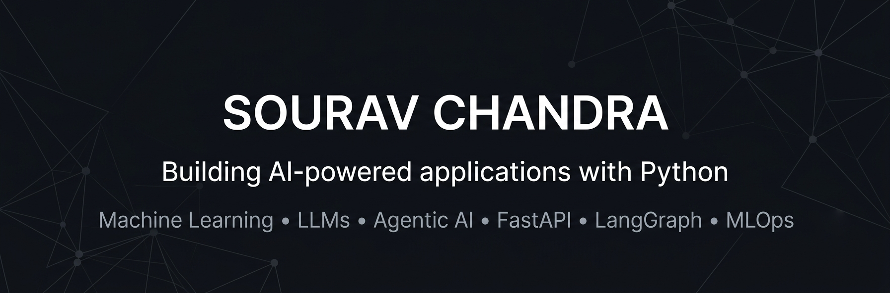

  

# Hi, I'm Sourav Chandra 👋

Building end-to-end AI applications with Python.

## Tech Stack

## Featured Projects

- 🎬 Agentic AI Content Studio
- 📚 LLMOps RAG Chatbot
- 📈 Credit Risk MLOps Pipeline
- 🩺 Swasthya Medical Assistant

## Connect

- 💼 LinkedIn: https://www.linkedin.com/in/sourav-chandra-5a3112265
- 📧 Email: souravchandra133@gmail.com